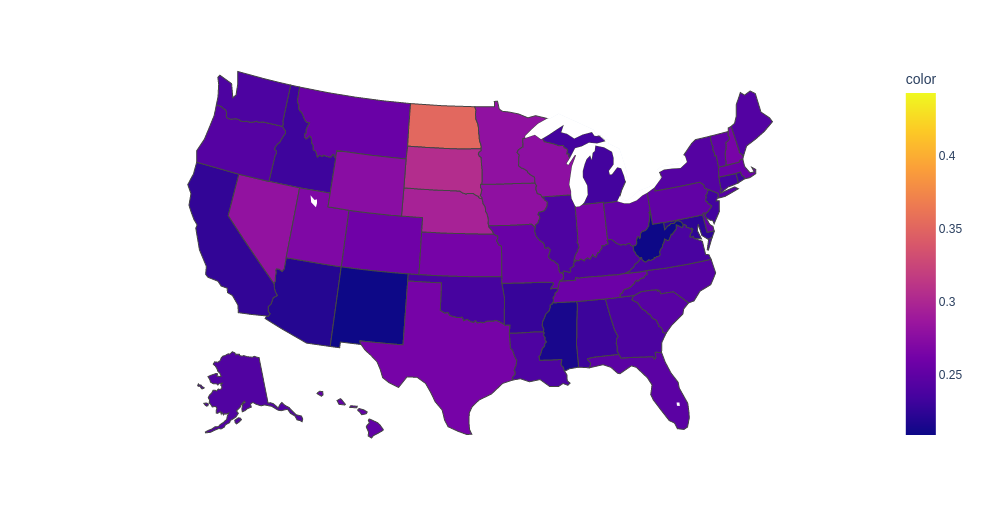

# Predicted Job Losses due to Automation



See [notebook](<./src/Predicted US Job Losses Due to Automation.ipynb>).

## Data Sources

[Kaggle](https://www.kaggle.com/andrewmvd/occupation-salary-and-likelihood-of-automation)

### Salary Data

```
@misc{u.s. bureau of labor statistics,
title={Occupational Employment Statistics},
url={https://www.bls.gov/oes/current/oes_nat.htm},
journal={U.S. BUREAU OF LABOR STATISTICS}}
```

### Automation Data

```
@article{freyosborne2017,
title={The future of employment: How susceptible are jobs to computerisation?},
volume={114},
DOI={10.1016/j.techfore.2016.08.019},
journal={Technological Forecasting and Social Change},
author={Frey, Carl Benedikt and Osborne, Michael A.},
year={2017},
pages={254–280}}
```

### License

License was not specified at the source.
